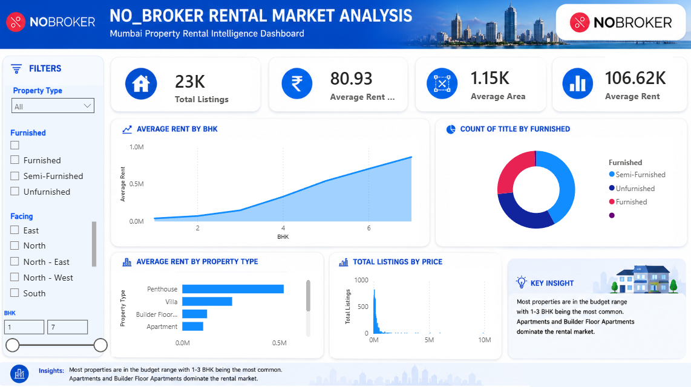
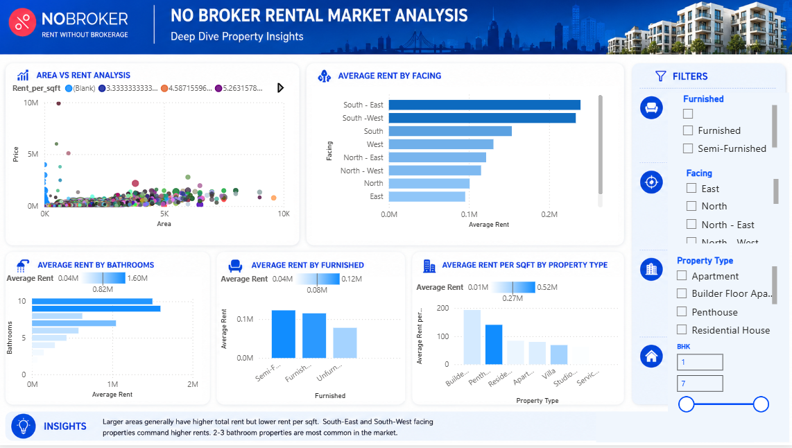
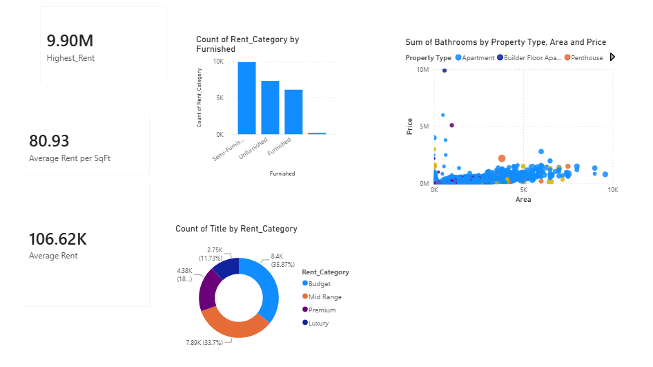

# NoBroker Rental Market Analysis Dashboard

## Project Overview

This project analyzes more than 23,000 rental property listings from Mumbai to identify rental trends, property characteristics, furnishing preferences, and premium property segments.

The dashboard was developed using Power BI, Power Query, DAX, and Python to transform raw real-estate data into actionable business insights.

---

## Tools Used

* Power BI
* Power Query
* DAX
* Python
* Data Cleaning
* Data Visualization

---

## Dataset Information

* Total Records: 23,405+
* City: Mumbai
* Property Types:

  * Apartment
  * Builder Floor Apartment
  * Residential House
  * Penthouse
  * Villa
  * Studio Apartment

---

## Key Business Insights

* Apartments dominate Mumbai's rental market.
* Semi-Furnished properties represent the largest share of listings.
* Higher BHK properties command significantly higher rents.
* Premium and Luxury segments contribute a substantial portion of rental value.
* South-East and South-West facing properties show higher average rents.

---

## Dashboard Pages

### 1. Market Overview

* Total Listings
* Average Rent
* Average Area
* Average Rent per SqFt
* Rent by BHK
* Property Type Analysis
* Furnishing Distribution

---

### 2. Property Insights

* Area vs Rent Analysis
* Rent by Facing
* Rent by Bathrooms
* Rent by Furnishing Status
* Rent per SqFt by Property Type

---

### 3. Premium Property Analysis

* Highest Rent Properties
* Rent Category Distribution
* Premium Segment Analysis
* Luxury Market Insights

---

## Project Workflow

Raw Dataset
→ Python Data Cleaning
→ Power Query Transformation
→ DAX Measures
→ Interactive Power BI Dashboard

---

## Author

Kunal Muneshwar

Dashboard_Page-1.png
